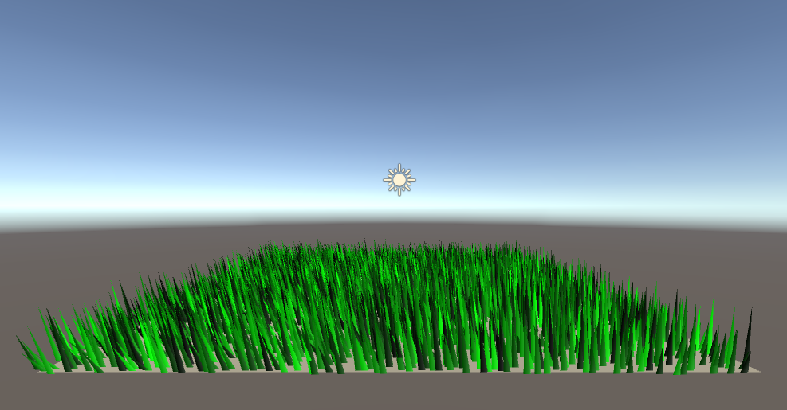

# 草をはやしてみよう
いい感じの草原を作ってください

# 自分なりに変更した点
-彩度に更にランダム性を与え、より色がまばらになるようにしました。
-パーリンノイズを少し変更し、風がよりリアルになるようにしました。
-p0頂点の色に変更を加え、より草らしく見えるようにしました。

# 進め方

- 本リポジトリをフォークしてください
- フォークしたリポジトリをcloneします
- Unityのプロジェクトを更新して実装してください。
- このテキストファイルに変更点を記載してください
- result.gifを自分の結果を保存して差し替えてください
- プルリクエストを出して提出してください
